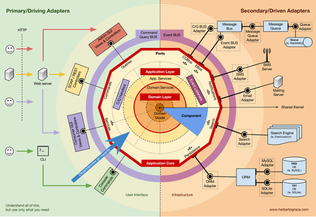

**Định nghĩa:**

Hexagonal Architecture hay còn gọi là Ports and Adapters Architecture là một kiến trúc phần mềm mà trong đó business logic nằm ở trung tâm (Domain) và không được phép tiếp xúc với các yếu tố bên ngoài như DB, UI hay framework. Mọi tương tác với Domain đều thông qua các interface (Port) do Domain định nghĩa, không phụ thuộc vào implementation cụ thể. Từ đó có thể thay thế adapter mà không sợ ảnh hưởng tới Domain.

**Components:**

Cấu trúc Hexagonal Architecture gồm 3 phần chính:

1. Domain (Core): Nằm ở trung tâm hệ thống và không phụ thuộc vào yếu tố bên ngoài. Domain bao gồm Business Logic,  Entity, Value Object, Use Case và Port. Nhiệm vụ chính của Domain là xử lý toàn bộ logic nghiệp vụ, quyết định hành vi của hệ thống và định nghĩa những gì mà hệ thống có thể làm. Đặc biệt chú ý Domain không được phép import Adapter.
1. Ports: Ports là interface do chính Domain định nghĩa, có 2 loại ports:
   1. Inbound Port dùng để làm đại diện cho các Use Case của hệ thống (vd: PlaceOrderUseCase) nhiệm chính là mô tả các hành vi do hệ thống cung cấp và cũng là danh sách của những hành động mà hệ thống cho phép thực hiện.
   1. Outbound Port được dùng để đại diện cho những gì Domain cần từ bên ngoài và được Domain định nghĩa (vd: PaymentGateway) nhiệm vụ chính là định nghĩa yêu cầu lưu trữ, định nghĩa yêu cầu giửi email, gọi API. Outbound Port không nói sẽ làm bằng công nghệ gì mà chỉ quan tâm Domain cần gì.
1. Adapters: Adapters là phần triển khai cụ thể của Ports, Adapter không được chứa business logic và Adapter phải phụ thuộc vào Port, không phải ngược lại. Có 2 loại Adapter:
   1. Inbound Adapter có nhiệm vụ chính là nhận request từ bên ngoài, convert dữ liệu, gọi vào Inbound Ports (vd: REST controller, GraphQL resolver, CLI).
   1. Outbound Adapter dùng cho các nhiệm vụ như triển khai Outbound Port, thực hiện lưu DB và gọi API (vd: MongoRepository, SMTPEmailAdapter, ExternalAPIAdapter).

**Data flows:**

Luồng dữ liệu trong Hexagonal Architecture hoạt động như sau:

Client --> Inbound Adapter --> Inbound Port --> Domain --> Outbound Port --> Outbound Adapter --> Database/API

Ta có thể giả sử có chức năng đăng ký sinh viên thì khi sinh viên nhấn nút đăng ký REST controller (Inbound Adapter) sẽ nhận yêu cầu, REST controller giống như người tiếp nhận hồ sơ chỉ đọc dữ liệu sau đó chuyển tiếp đến hệ thống (Domain) thông qua Inbound Port. Sau đó hệ thống sẽ kiểm tra tên có hợp lệ không, đã tồn tại chưa, có đủ điều kiện không, hệ thống (Domain) là nơi mà toàn bộ logic sẽ diễn ra. Sau khi kiểm tra hợp lệ, Domain thông qua Outbound Port để yêu cầu lưu dữ liệu, Adapter triển khai Port này sẽ thực hiện lưu data. Cuối cùng Adapter thực hiện lưu dữ liệu và trả kết quả thông qua Port cho Domain, Domain trả kết quả cho REST và REST trả cho sinh viên. Điểm quan trọng là Domain chỉ làm việc với các Port, không biết Adapter cụ thể nào đang được sử dụng.

**Ưu/Nhược điểm:**

Ưu điểm: 

- Bảo vệ được business logic
- Dễ thay đổi công nghệ
- Khả năng test cao
- Phù với các dự án lớn, dài hạn

Nhược điểm:

- Dễ bị phức tạp hóa (Over-engineering)
- Learning curve cao dễ gây hiểu nhầm
- Nhiều mapping, nhiều file
- Dễ áp dụng máy móc nếu không hiểu rõ

**Khi nào áp dụng:**

Nên dùng khi: 

- Dự án phức tạp về nghiệp vụ
- Nhiều rule, nhiều trạng thái
- Dự án có kế hoạch mở rộng lâu dài
- Có nhiều interface như là Web, Mobile, API, …
- Muốn test nghiêm túc 
- Muốn học kiến trúc bài bản

**So sánh:**

|Tiêu chí|Layered Architecture|Hexagonal Architecture|Clean Architecture|
| :-: | :-: | :-: | :-: |
|Độ phức tạp|Dễ hiểu, dễ học, ít khái niệm.|Phải hiểu được Port và Adapter, phải kiểm soát được dependency.|Nhiều layer khác nhau, nhiều khái niệm trừu tượng.|
|Khả năng bảo trì|Dễ hỏng khi đổi DB/UI, business logic dễ bị phân tán.|Core độc lập, không ảnh hưởng khi thay DB/UI.|Tách rõ ràng từng phần, rất ít khi phụ thuộc vào nhau.|
|Khả năng test|Test cần DB thật, khó tách riêng business logic.|Test core bằng mock port, test không cần infrastructure.|Core test hoàn toàn độc lập, dễ TDD (Test-Driven Development)|

**Nhật ký quy trình:**

**Workflow 1- Layered Questioning:**

- Đầu tiên hỏi về concept của cấu trúc Hexagonal Architecture và các thành phần chính của nó, tiếp đó yêu cầu AI liệt kê ra những quy tắc quan trọng mà dev phải chú ý khi làm việc cùng với hệ thống này. Sau đó yêu cầu AI đưa ra một ví dụ bằng code đơn giản để giúp mình dễ hiểu hơn về cấu trúc cũng như giúp mình phân biệt được đâu là port đâu là adapter. Cuối cùng tôi đặt ra thêm một số câu hỏi để hiểu rõ hơn về ranh giới của port và adapter, sự phụ thuộc ngược của domain đối với DTO, tính chính danh của cấu trúc thư mục và hệ lụy khi bỏ qua domain/application service trong luồng xử lý.

**Workflow 2- Solution Exploration:**

- Đầu tiên yêu cầu AI so sánh sự khác biệt dựa trên các tiêu chí như phức tạp, khả năng bảo trì và khả năng test của Hexagonal Architecture đối với các architecture khác như Layered hay là Clean Architecture. Sau đó hỏi khi nào nên sử dụng Hexagonal Architecture hay là MVC và các rủi ro mà tôi có thể gặp. Cuối cùng tôi dựa vào dự án cá nhân của mình đặt ra câu hỏi xem với dự án X-style clone đơn giản thì tôi có thể áp dụng Hexagonal Architecture không để biết được khi nào nên dùng Hexagonal Architecture khi nào thì dùng các architecture khác.

**Workflow 3 - Iterative Refinement:**

- Cho AI tổng hợp lại những gì đã nghiên cứu từ trên thành một cấu trúc logic, đọc và yêu cầu giải thích chi tiết cho những phần tôi cảm thấy trừu tượng. Cuối cùng cho AI vào vai một senior architecture để review lại báo cáo cũng như chỉ ra những sai sót hoặc những điểm dễ gây hiểu lầm.

